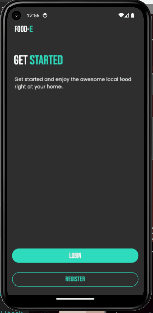
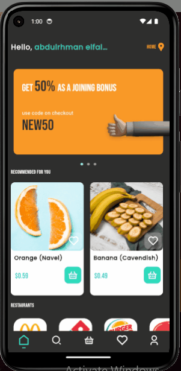

# Food E App 🍽️
Welcome to the Food E App Project! 🎉 

This project serves as an exciting learning experience in building a user-friendly interface for managing account profiles and viewing order history. It showcases the powerful capabilities of Flutter in creating beautiful and responsive UIs. ✨

## Copyrights 📝
All UI rights reserved to [Satwik Gawand 🦄](https://bento.me/satwikgawand)

   

## Technologies & Packages 💻
- **animate_do** 🎭: ^3.3.4
- **app_links** 🔗: ^6.3.3
- **cloud_firestore** ☁️: ^5.6.0
- **cupertino_icons** 🎨: ^1.0.6
- **curved_navigation_bar** 🧭: ^1.0.6
- **firebase_auth** 🔐: ^5.3.4
- **firebase_core** 🔥: ^3.9.0
- **firebase_storage** 💾: ^12.3.7
- **flutter** 💙: SDK for building the app
- **flutter_dotenv** 🌍: ^5.2.1
- **flutter_image_slideshow** 🖼️: ^0.1.6
- **flutter_riverpod** ⚡: ^2.6.1
- **flutter_svg** 🎯: ^2.0.10+1
- **fpdart** 🎯: ^1.1.1
- **get_it** 🎯: ^8.0.3
- **get_storage** 📦: ^2.1.1
- **google_fonts** 📝: ^6.2.1
- **intl** 🌐: ^0.19.0
- **skeletonizer** 💀: ^1.4.3
- **top_snackbar_flutter** 🍞: ^3.1.0
- **url_launcher** 🚀: ^6.3.0

## Features 🪶
- **Account Profile Management** 👤: Easily update your profile information
- **User Authentication** 🔒: Securely log in and out of your account
- **Explore Menu** 🍕: Browse through a variety of food items and add them to your cart
- **Cart Management** 🛒: View and manage the items in your cart before placing an order
- **Order History** 📜: View your past orders in a clean and organized manner
- **Custom App Bar** 🎨: A sleek and modern app bar for easy navigation
- **Responsive Layouts** 📱: Designed to look great on all screen sizes
- **Interactive Components** 🎮: Buttons, sliders, and more for a dynamic user experience
- **Animations** ✨: Smooth transitions and visual effects for an engaging user experience

## Note 📝
This project is a labor of love 💝, primarily focused on crafting beautiful UI experiences and exploring Flutter's magical capabilities ✨. While it may not include backend functionalities at the moment 🚧, it passionately lays the groundwork for future development 🌱 and demonstrates the art of creating stunning responsive layouts and delightful interactive components 🎨. We're excited to see how this project will evolve and grow! 🚀

## Screenshots 📸
- *Splash screen*

   

- *Register a new user*

   

- *Explore the application *

   

